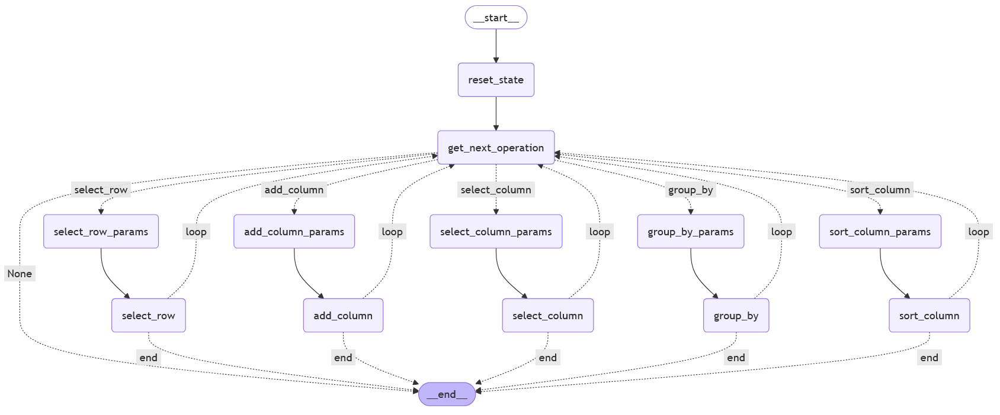

# Scalable Chain of Table

Dieses System ist inspiriert durch 'chain-of-table' [Quelle]. Die Idee ist es, eine Tabelle Schritt für Schritt zu verformen, um so eine Nutzungsanfrage zu beantworten.

# Einstieg

Die main.py Funktion dient als Einstiegspunkt zum Testen des Systems. Dort lassen sich alle relevanten Parameter spezifizieren: 

- Model: Aktuell werden ChatGPT und Mistral Nemo unterstützt
- Der Datensatz: Es gibt zwei Beispieldatensätze unter data. data\tabfacts.py wurde von der chain-of-table Quelle übernommen und zu einigen Einträgen Erläuterungen zu den Spalten hinzugefügt. Enthalten die Einträge keine Erläuterungen kommt es zu einem Fehler.

# Architektur

Die Agentenstruktur, um die Tabellenumformung zu erhalten, basiert auf Langgraph und ist im Ordner \graph spezifiziert.

# Integration & Validierung

Die LLMs wurden mit <a href="https://python.useinstructor.com/">Instructor</a> modifiziert, wodurch sie strukturierte Objekte basierend auf Pydantic ausgeben können. Dadurch ist es möglich, die Ausgabe zu validieren und fehlerhaft Ausgaben an das Modell zurückzuspielen.

# Aktuelle Probleme:

Obwohl CoT funktioniert, kommt es häufig vor, dass das Modell zwar richtig argumentiert, aber dann eine falsche Antwort gibt.

## Beispiel 1

user query: the wildcats lost one game in september and two games in november

function chain:
Selected rows based on the following conditions:
date contains september, result contains loss, record == 1, date contains november, record == 2, 

table caption : 1947 kentucky wildcats football team

col : game | date | opponent | result | wildcats points | opponents | record
row 1 : 1 | sept 20 | ole miss | loss | 7 | 14 | nan
row 2 : 7 | nov 1 | 18 alabama | loss | 0 | 13 | nan
row 3 : 10 | nov 22 | tennessee | loss | 6 | 13 | nan

evaluation output:
The user statement claims that the Wildcats lost one game in September and two games in November. However, according to the table, they lost one game in September (Ole Miss) and two games in November (Alabama and Tennessee), which confirms the user's statement is true. The operations selected the correct rows based on the conditions, confirming the user's claim.

model evaluation: False

baseline output:
The user statement claims that the Wildcats lost one game in September and two games in November. According to the table, the Wildcats lost one game in September (against Ole Miss on Sept 20) and two games in November (against Alabama on Nov 1 and Tennessee on Nov 22). Therefore, the statement is true.

model evaluation: False

label: True

## Beispiel 2

user query: the most the wildcats outscored an opponent is by 26 points

function chain:
Selected rows based on the following conditions:
wildcats points > 26, 

table caption : 1947 kentucky wildcats football team

col : game | date | opponent | result | wildcats points | opponents | record
row 1 : 9 | nov 15 | evansville | win | 36 | 0 | 7 - 2

evaluation output:
The only game listed shows that the Wildcats scored 36 points and their opponent scored 0 points, which means they outscored their opponent by 36 points. Therefore, it is true that the most the Wildcats outscored an opponent is by 26 points as 36 is greater than 26.

model evaluation: True

baseline output:
To evaluate the statement 'the most the wildcats outscored an opponent is by 26 points', we examine the results in the table. The Wildcats' largest victory margin can be calculated by looking at the points scored versus the points allowed in each game. They outscored their opponent by the following margins: against Cincinnati, they won by 20 points (20 - 0); against Xavier, they won by 13 points (20 - 7); against Georgia, they won by 26 points (26 - 0); against Vanderbilt, they won by 14 points (14 - 0); against Michigan State, they won by 1 point (7 - 6); against Alabama, they lost by 13 points (0 - 13); against West Virginia, they won by 9 points (15 - 6); against Evansville, they won by 36 points (36 - 0); against Tennessee, they lost by 7 points (6 - 13). The largest outscoring by the Wildcats was not 26 points but rather 36 points against Evansville. Therefore, the statement is false.

model evaluation: False

label: False